# Yiyang Partners - Performance History

Performance Tracking of [Yiyang Partners](../README.md)

## Yearly Performance

| Year | Starting Value | Ending Value | Yearly Performance (TWR) |
|---|---|---|---|
| 2024 (ytd) | 12,337.82 | 100,306.25 |$${\color{green}258.25\\%}$$ |
| 2023 - 0 | 12,337.82 |$${\color{green}1.34\\%}$$ |

(last update: Jun. 27, 2024)

## Monthly Performance

| Month | Starting Value | Ending Value | Monthly Performance (TWR) |
|---|---|---|---|
| 2024 - 06 | 74810.85 | 100,306.25 |$${\color{green}35.04\\%}$$ |
| 2024 - 05 | 49,546.10 | 74810.85 |$${\color{green}50.99\\%}$$ |
| 2024 - 04 | 57671.61	| 49546.10 |$${\color{red}-15.81\\%}$$ |
| 2024 - 03 | 45627.36	| 57671.61 |$${\color{green}24.51\\%}$$ |
| 2024 - 02 | 26540.06 | 45627.36 |$${\color{green}38.39\\%}$$ |
| 2024 - 01 | 12337.82 | 26540.06 |$${\color{green}21.99\\%}$$ |
| 2023 - 12 | 9723.69 | 12337.82 |$${\color{green}26.88\\%}$$ |
| 2023 - 11 | 6480.31 | 9723.69 |$${\color{green}50.05\\%}$$ |
| 2023 - 10 | 3389.86 | 6480.31 |$${\color{red}-18.72\\%}$$ |
| 2023 - 09 | 3582.80 | 3389.86 |$${\color{red}-28.44\\%}$$ |
| 2023 - 08 | 1027.17 | 3582.80 |$${\color{red}-7.91\\%}$$ |
| 2023 - 07 | 753.23 | 1027.17 |$${\color{red}-2.47\\%}$$ |
| 2023 - 06 | 348.45 | 753.23 |$${\color{red}-7.97\\%}$$ |
| 2023 - 05 - 0.00 | 348.45 |$${\color{green}10.72\\%}$$ |

(last update: Jun. 27, 2024)

## May 2024

Starting Value: 49,546.10

Ending Value: 74810.85

| Time Weighted Rate of Return | $${\color{green}50.99\\%}$$ |
|---|---|

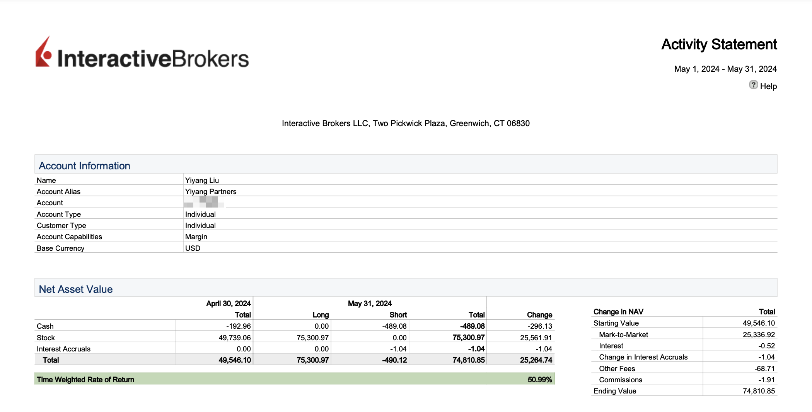

## Apr. 2024

Starting Value: 57,671.61

Ending Value: 49,546.10

| Time Weighted Rate of Return | $${\color{red}-15.81\\%}$$ |
|---|---|

## Mar. 2024

Starting Value: 45,627.36

Ending Value: 57,671.61

| Time Weighted Rate of Return | $${\color{green}24.51\\%}$$ |
|---|---|

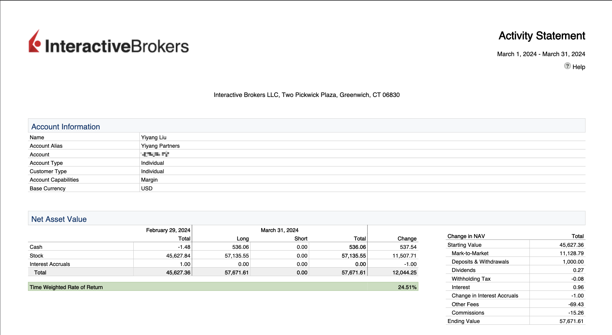

## Feb. 2024

Starting Value: 26,540.06

Ending Value: 45,627.36

| Time Weighted Rate of Return | $${\color{green}38.39\\%}$$ |
|---|---|

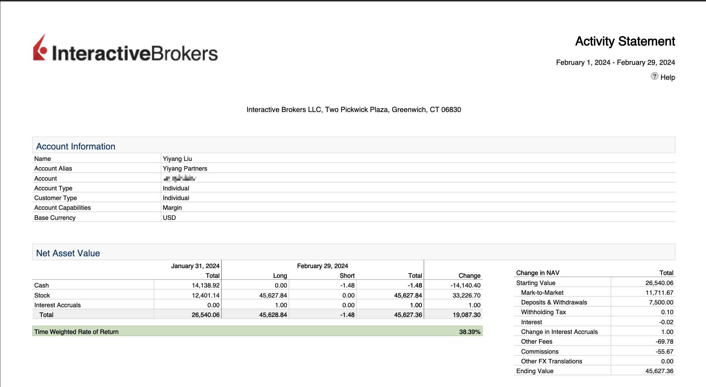

## Jan. 2024

Starting Value: 12,337.82

Ending Value: 26,540.06

| Time Weighted Rate of Return | $${\color{green}21.99\\%}$$ |
|---|---|

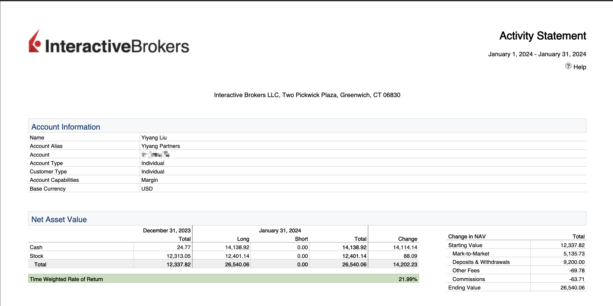

## Dec. 2023

Starting Value: 9,723.69

Ending Value: 12,337.82

| Time Weighted Rate of Return | $${\color{green}26.88\\%}$$ |
|---|---|

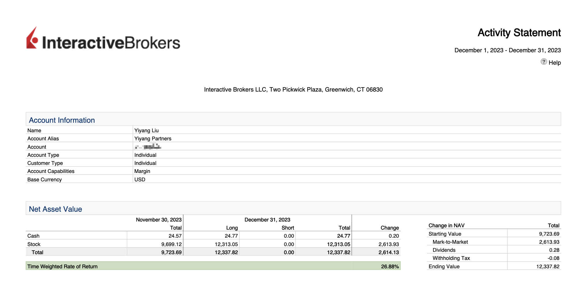

## Nov. 2023
Starting Value: 6,480.31

Ending Value: 9,723.69

| Time Weighted Rate of Return | $${\color{green}50.05\\%}$$ |
|---|---|

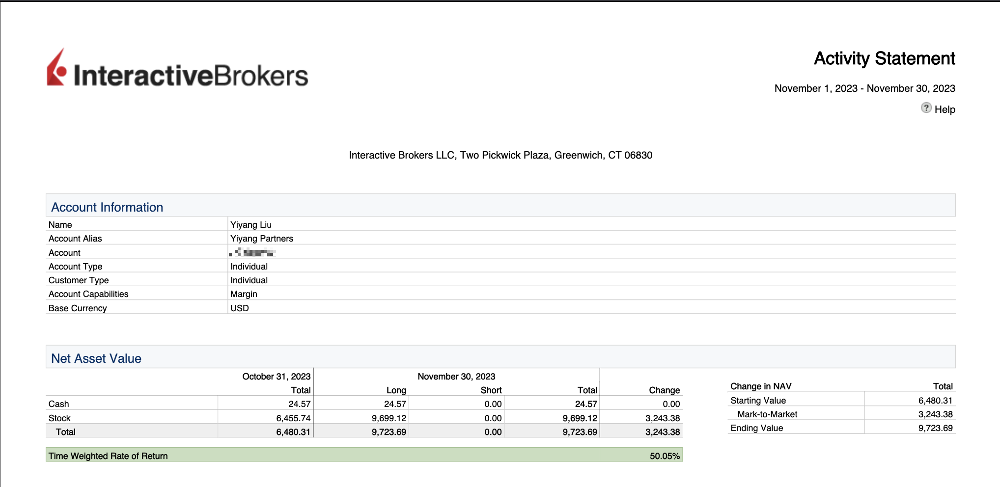

## Oct. 2023
Starting Value: 3,389.86

Ending Value: 6,480.31

| Time Weighted Rate of Return | $${\color{red}-18.72\\%}$$ |
|---|---|

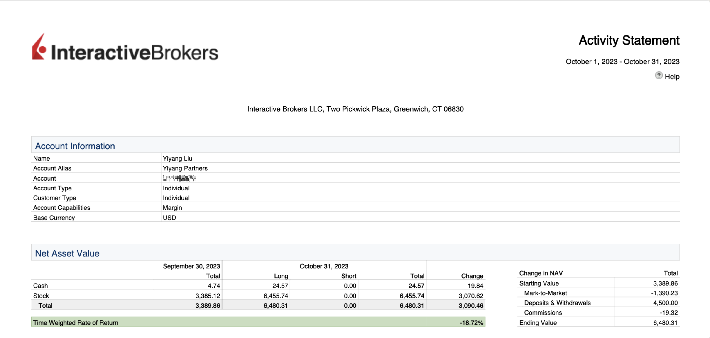

## Sep. 2023
Starting Value: 3,582.80

Ending Value: 3,389.86

| Time Weighted Rate of Return | $${\color{red}-28.44\\%}$$ |
|---|---|

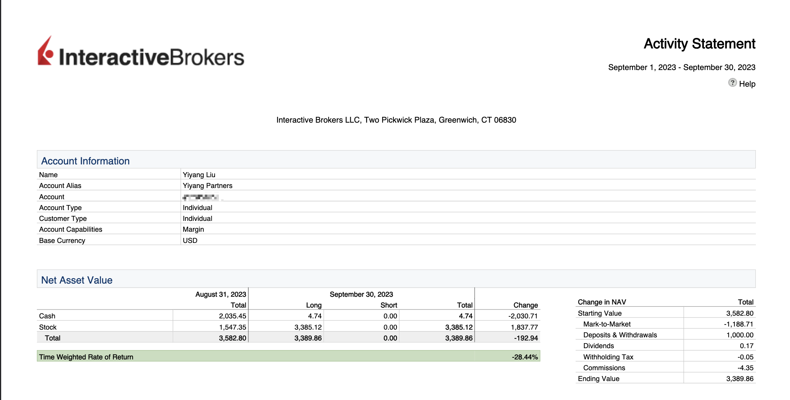

## Aug. 2023

Starting Value: 1,027.17

Ending Value: 3,582.80

| Time Weighted Rate of Return | $${\color{red}-7.91\\%}$$ |
|---|---|

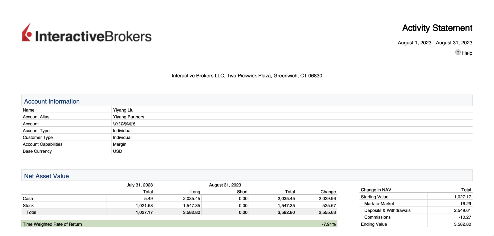

## Jul. 2023

Starting Value: 753.23

Ending Value: 1,027.17

| Time Weighted Rate of Return | $${\color{red}-2.47\\%}$$ |
|---|---|

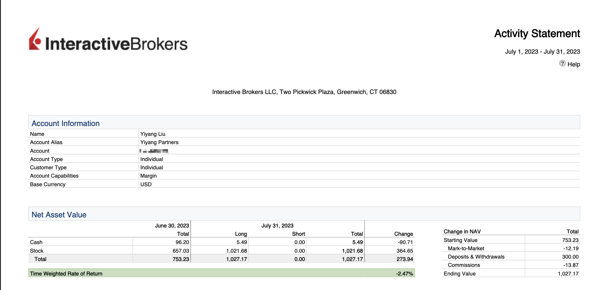

## Jun. 2023

Starting Value: 348.45

Ending Value: 753.23

| Time Weighted Rate of Return | $${\color{red}-7.97\\%}$$ |
|---|---|

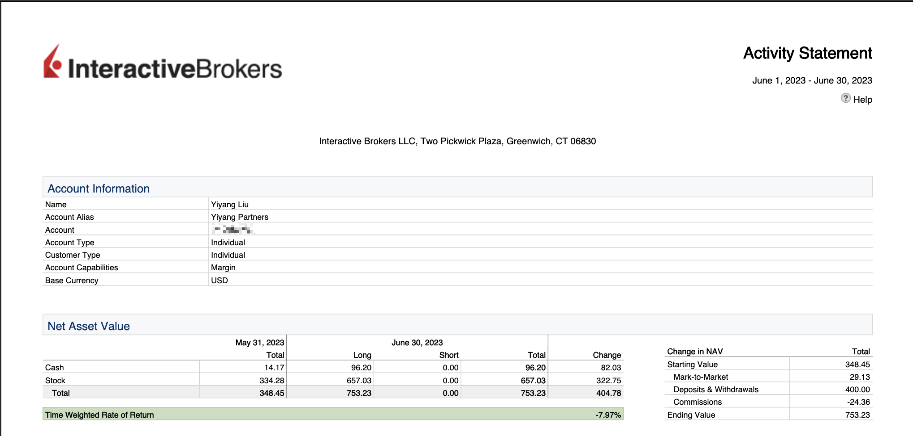

## May 2023

Starting Value: 0.00

Ending Value: 348.45

| Time Weighted Rate of Return | $${\color{green}10.72\\%}$$ |
|---|---|

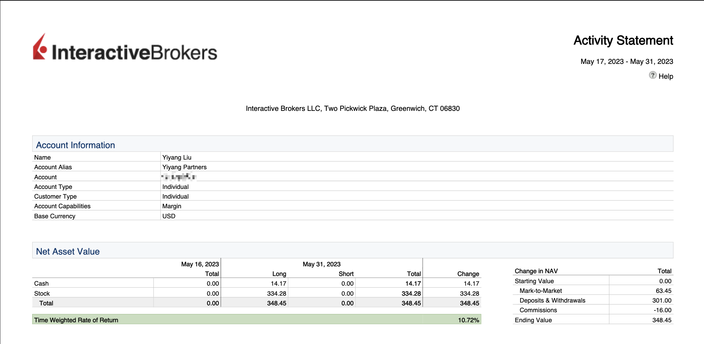